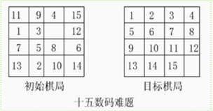

# 十五数码问题
A* 算法，python 实现，3min 出解  

十五数码是经典的八数码问题的推广。八数码问题是在一个 3\*3 的格子上，排布着编号为 1-8 的方块，剩下一个格子是空位。每一步，空位的上向上下左右四个方向相邻方块可以移动到空位。本问题给定初始位置和目标位置，要求通过一系列的数码移动，将初始状态转化为目标状态。十五数码将这个问题推广到 4\*4 的方格上。
一个起始和目标状态的例子如图：  

  

设计 Board 类表示一个状态（即一个棋盘布局），Node 类表示搜索树中的一个节点。在实验中发现存在耗时过长，搜不出解的情况，对此优化如下：
 - close 表用集合表示
 - 存储 f 值（启发值）
 - 将 open 表做成 heap - 最小堆

优化后求解耗时：2min 55s，解的深度为：41，已扩展结点为：185896，open表中节点为：177171。
